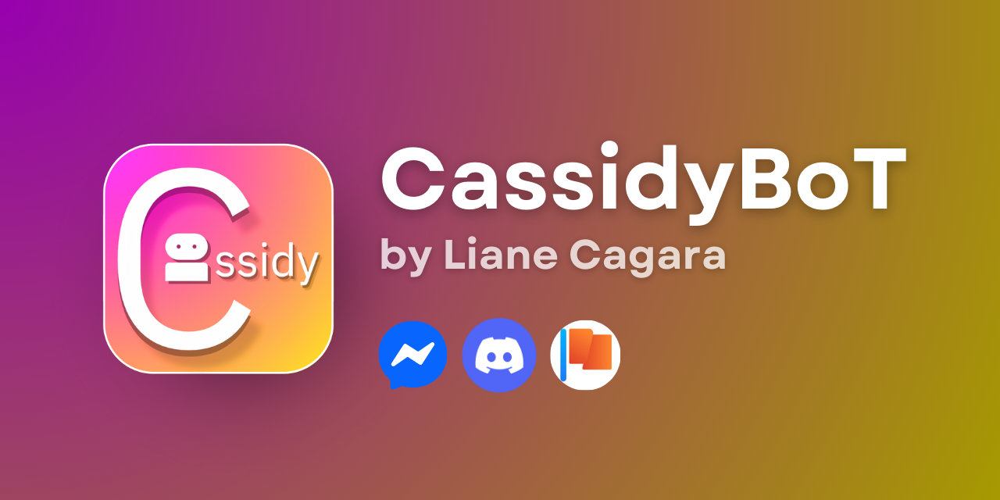

# CassidySpectra (CassidyBoT 3.6+)

CassidySpectra is the first ever all-around (Personal Fb bot, Page Bot, Discord Bot, Web Bot) chatbot with the best Typescript Tooling and Rich Libraries. CassidySpectra is also a fork of CassidyRedux which is a revamped version of CassidyBoT with enhanced features and improved performance, created and well-maintained by Liane Cagara (lianecagara in github).

</img>


## Table of Contents

- [Introduction](#introduction)
- [Features](#features)
- [Changelog](#changelog)
- [Getting Started](#getting-started)
  - [Prerequisites](#prerequisites)
  - [Installation](#installation)
  - [Configuration](#configuration)
  - [Deployment](#deployment)
- [Creating Commands](#creating-commands)
  - [Command Structure](#command-structure)
  - [Meta Options](#meta-options)
  - [Context Variables](#context-variables)
  - [Example Command](#example-command)
- [Core Files](#core-files)
- [License](#license)

## Introduction

CassidySpectra is designed to be a powerful and extensible bot framework that allows developers to create and manage a wide range of commands and functionalities. It leverages modern JavaScript and TypeScript features and provides a structured approach to command creation and management.

## Features

- **Best Tooling**: The first Facebook Bot framework with best tooling support, and advanced typescript autocomplete and type safety.
- **Command Management**: Easily create, register, and manage commands.
- **Automatic Fonts**: Use unicode fonts the same way as markdown fonts.
- **Premade Components**: Templates like UTShop and GameSimulator, ReduxCMDHome and SpectralCMDHome as an abstraction layer for your commands!
- **Automatic Styling**: Add lines and titles to your command automatically.
- **Page Support**: Works on pages (business chats) too!
- **Personal Account Login**: The typical facebook bot.
- **Discord** (Partial)
- **API Integration**: Integrate with various APIs to extend the bot's capabilities.
- **Customizable**: Highly customizable with support for plugins and middleware.
- **Performance**: Optimized for performance with parallel execution of plugins.
- **Extensible**: Support for external plugins and modules.
- **User Management**: Manage users, permissions, and roles.
- **Inventory System**: Advanced inventory management with support for indexing and limits.
- **Database** - Built-in MongoDB Asbtraction.
- **Idle Games**: Built-in support for idle games.
- **Enhanced UI**: Improved user interface with support for themes and custom fonts.
- **Better Plugin Handling**: Improved plugin handling using promises.
- **Richer Database**: Richer but simpler database.

## Getting Started

# Cassidy Bot Tutorial

Welcome to the Cassidy Bot tutorial! 🎉 This guide will walk you through setting up and running the Cassidy bot on Railway. Cassidy is a bot that connects with Facebook Messenger (and optionally Discord) to automate your interactions. Follow these steps to get it up and running smoothly! 😎

---

## Prerequisites

Before you start, make sure you have:

- A GitHub account 📂
- A Facebook Page (create one if you don’t have it yet) 📘
- A dummy Facebook account (don’t use your main account!) 🤖
- A browser with extension support (e.g., Kiwi Browser) 🌐
- The "Cookie Editor" extension installed 🛠️
- A Railway account ([sign up here](https://railway.app)) 🚂

---

## Step 1: Fork the Main Repository 🍴

Get your own copy of the Cassidy bot code by forking the main repository or generating from it's template.

1. Visit the main repo: [https://github.com/lianecagara/CassidySpectra](https://github.com/lianecagara/CassidySpectra).
2. Click the **"Fork"** or **Use Template** button in the top-right corner. (we suggest to use template to get the ability to make your repository private (nobody else sees!))
3. Select your GitHub account to create your forked/generated repo.

Your forked/generated repository will be at `https://github.com/your-username/CassidySpectra`. ✅

---

## Step 2: Set Up a Dummy Facebook Account & Get Cookies 🍪

You’ll need a dummy Facebook account to run the bot safely.

1. Create a new dummy Facebook account (not your main one!).
2. Open the account in a browser with extension support (e.g., Kiwi Browser, Microsoft Edge, Chrome (PC)).
3. Install the **"Cookie Editor"** or best, **"C3C FBState"** extension from the Chrome Web Store.
4. Click the Cookie Editor icon and export the cookies in **JSON format**.
5. Setup a programming environment (ex. Visual Studio Code, Replit)
6. Clone your previously generated repository, example:
```bash
git clone https://github.com/your-username/CassidySpectra
cd CassidySpectra
```
7. In your forked repo, find the `cookie.json` file.
8. Replace its contents with your exported JSON cookies.
9. (Optional) run this bash command: (only if you have an .env file)
```bash
node hidestate
```
This command will hide your appstate or cookie.

**⚠️ Warning:** Don’t commit sensitive info like cookies to a public repo! If your fork is public, make it private or use environment variables instead. (Also don't ever push .env to your repo)

---

## Step 3: (Optional) Set Up Discord Integration 🎮

Want Cassidy to work with Discord too? This step is optional!

1. Head to the [Discord Developer Portal](https://discord.com/developers/applications).
2. Create a new application or pick an existing one.
3. Go to the **"Bot"** section and create a bot.
4. Copy the bot token.
5. Add the token to the right file in your forked repo (e.g., `settings.json`—check the repo docs for details).
```json
{
 // other infos...
  "discordBotToken": "",
  "discordClientID": "",
}
```

**Note:** This is optional and might depend on the bot’s setup. Skip if you’re only using Facebook Messenger.

---

## Step 4: Set Up Facebook Messenger Integration 📩

To make Cassidy work with Facebook Messenger, you’ll need to configure it via Facebook Developers.

### Prerequisites
- A Facebook Page (create one if you don’t have it).

### Steps
1. **Go to Facebook Developers:**
   - Visit [developers.facebook.com](https://developers.facebook.com).

2. **Create a Developer Account (if needed):**
   - Log in with your Facebook account and set up a developer profile.

3. **Create an App:**
   - Click **"My Apps"** > **"Create App"**.
   - Select **"Business"** as the app type.
   - Enter the app name and email, then hit **"Create App ID"**.

4. **Add Messenger Product:**
   - In the sidebar, click **"Add Product"**.
   - Find **"Messenger"** and click **"Set Up"**.

5. **Connect Your Facebook Page:**
   - Scroll to **"Access Tokens"**.
   - Click **"Add or Remove Pages"** and link your page.
   - Generate a **Page Access Token** by clicking **"Generate Token"**. Copy it!

6. **Set Up Webhooks:**
   - Go to **"Webhooks"** in Messenger settings.
   - Click **"Setup Webhooks"**.
   - Fill in:
     - **Callback URL:** `https://your_hosting.site/webhook` (update this later after deployment).
     - **Verify Token:** `(make your own verify token in the developer.facebook.com example: pagebot you put in the developer.facebook.com verify token pagebot and get the verify token once again and put it in the settings.json)`
     - Warn: Never leak verify token.
   - Subscribe to:
     - `messages`
     - `messaging_optins`
     - `messaging_postbacks`
   - Click **"Verify and Save"**.

   **Note:** You’ll update the Callback URL after deploying on Railway.

7. **Add Page Subscriptions:**
   - In **"Page Subscriptions"**, select your connected page.
   - Ensure `messages`, `messaging_optins`, and `messaging_postbacks` are checked.

8. **Get Your Page Access Token:**
   - Back in **"Access Tokens"**, copy the Page Access Token.

9. **Add Token to Bot:**
   - In your forked repo, open `settings.json`.
   - Paste the Page Access Token there.
```json
{
 // other infos...
  "pageAccessToken": "",
  "pageVerifyToken": "",
}
```

**⚠️ Warning:** Don’t commit tokens to a public repo! Use environment variables if possible.

---

## Step 5: Configure the Bot ⚙️

Double-check these files in your forked repo:
- `cookie.json`: Has your dummy account’s cookies.
- `settings.json`: Has your Page Access Token.
- (Optional) Discord token file, if you set up Discord.

---

## Step 6: Deploy on Railway 🚂

Time to get Cassidy live using Railway and Docker!

### Prerequisites
- A Railway account ([railway.app](https://railway.app)).
- Docker installed locally (optional, for testing).

### Steps
1. **Check the Dockerfile:**
   - Your forked repo should have a Dockerfile set for **Node.js 23.7.0 or higher**.  
   **⚠️ Important:** Lower versions will cause errors!

2. **Create a Railway Project:**
   - Log in to Railway.
   - Click **"New Project"** > **"Deploy from GitHub repo"**.
   - Pick your forked Cassidy-Spectra repo.

3. **Set Up Deployment:**
   - Railway will use the Dockerfile automatically.
   - Set the server region to **USA Oregon** (no other regions allowed!).

   **⚠️ Important:** USA Oregon is required for proper operation.

4. **Setup Environment Variables**
   - Add your MONGO_URI and APPSTATE there. 

4. **Deploy the Bot:**
   - Hit **"Deploy"** and wait for it to finish.
   - Railway will give you a URL (e.g., `https://your-project-name.up.railway.app`).

5. **Update Webhook URL:**
   - Return to Facebook Developer settings.
   - In **"Webhooks"**, update the Callback URL to your Railway URL + `/webhook` (e.g., `https://your-project-name.up.railway.app/webhook`).
   - Verify and save.

---

## Bonus Step: For Persistent Database
1. Create a .env file in the root directory and add the following:

```env
MONGO_URI="replace with the mongodb uri"
```

### Deployment

1. To deploy the bot, simply run:

```bash
npm start
```

## Step 7: Test Your Messenger Bot 🧪

Let’s make sure it works!

1. **Open Your Facebook Page:**
   - Go to the page you connected.

2. **Send a Test Message:**
   - Use a different account (not the dummy one) to message the page.
   - Try sending **"help"** to see available commands.

**Note:** The bot only responds to accounts with specific roles in the app. Add roles next!

---

## Adding Roles 👤

To let certain accounts interact with the bot, assign roles in your Facebook app.

1. **Go to [developers.facebook.com](https://developers.facebook.com):**
   - Log in to your developer account.

2. **Access Your App:**
   - Find your app in **"My Apps"**.

3. **Select "App Roles":**
   - Look for **"App Roles"** or **"Roles and Permissions"**.

4. **Add Roles:**
   - Click **"Add Role"** and define the role name/permissions.

5. **Assign Roles to Users:**
   - Assign the role to the accounts you want to use with the bot (provide their name or ID).

**Note:** Ensure your test account has a role assigned to get responses!

---

## Final Notes 📝

- Keep cookies and tokens secure—don’t expose them in a public repo! 🔒
- Check Railway logs if you run into issues. 🕵️‍♂️
- For more features, peek at the repo’s documentation. 📚

Congrats! Your Cassidy bot is now running on Railway. Enjoy automating your Messenger tasks! 🎉
 


## Creating Commands

### Command Structure

A command in CassidySpectra is typically defined in a JavaScript file with the following structure:

```javascript
export const meta = {
    name: "example",
    otherNames: ["ex", "examples"],
    author: "Author's Name",
    version: '1.0.0',
    description: "This is an example command used in demonstration.",
    usage: "{prefix}{name}",
    category: "Examples",
    noPrefix: "both",
    permissions: [0, 1, 2],
    botAdmin: false,
    waitingTime: 10,
    ext_plugins: {
        output: "^1.0.0"
    },
    whiteList: [
        "id1",
        "id2"
    ],
    args: [
        {
            degree: 0,
            fallback: null,
            response: "You cannot use this argument",
            search: "disallowedArg",
            required: false,
        }
    ],
    supported: "^1.0.0"
};

export async function entry({ input, output }) {
    output.reply('Hello, this is an example command!');
}
```

### Meta Options

The `meta` object contains important configuration information for the command. Here are the available options:

- **name**: The primary name of the command.
- **otherNames**: An array of alternative names for the command.
- **author**: The author of the command.
- **version**: The version of the command.
- **description**: A brief description of what the command does.
- **usage**: Instructions on how to use the command.
- **category**: The category under which the command falls.
- **noPrefix**: Specifies whether the command can be used without a prefix. Possible values are "both", true, or false.
- **permissions**: An array specifying the required permissions to use the command. (0: non-admin, 1: gc admin, 2: bot admin)
- **botAdmin**: A boolean indicating whether the command requires bot admin permissions.
- **waitingTime**: The cooldown time (in seconds) before the command can be used again.
- **ext_plugins**: An object specifying external plugins required by the command.
- **whiteList**: An array of user IDs that are allowed to use the command.
- **args**: An array of argument configurations. Each argument can have the following properties:
  - **degree**: The degree of the argument.
  - **fallback**: The fallback value if the argument is not provided.
  - **response**: The response message if the argument is not allowed.
  - **search**: The search term for the argument.
  - **required**: A boolean indicating whether the argument is required.
- **supported**: The supported version of the command.

### Context Variables

When defining the `entry` function for your command, you have access to several context variables:

- **input**: The input object containing information about the command invocation.
  - **input.text**: The text of the command.
  - **input.senderID**: The ID of the user who sent the command.
  - **input.threadID**: The ID of the thread where the command was sent.
  - **input.arguments**: An array of arguments passed to the command.
  - **input.isAdmin**: A boolean indicating whether the user is an admin.
  - **input.replier**: The replier object if the command is a reply.
- **output**: The output object used to send responses back to the user.
  - **output.reply(text)**: Sends a reply to the user.
  - **output.error(err)**: Sends an error message to the user.
  - **output.send(text, id)**: Sends a message to a specific user or thread.
  - **output.add(user, thread)**: Adds a user to a thread.
  - **output.kick(user, thread)**: Kicks a user from a thread.
  - **output.unsend(mid)**: Unsend a message by its ID.
  - **output.reaction(emoji, mid)**: Reacts to a message with an emoji.
- **event**: The event object containing details about the event that triggered the command.
- **api**: The API object for interacting with the platform (e.g., sending messages).
- **commandName**: The name of the command being executed.
- **args**: An array of arguments passed to the command.

### Example Command

Here is a more detailed example of a command that uses various meta options and context variables:

```javascript
export const meta = {
    name: "greet",
    otherNames: ["hello", "hi"],
    author: "Author's Name",
    version: '1.0.0',
    description: "Sends a greeting message.",
    usage: "{prefix}greet [name]",
    category: "General",
    noPrefix: "both",
    permissions: [0],
    botAdmin: false,
    waitingTime: 5,
    ext_plugins: {
        output: "^1.0.0"
    },
    whiteList: null,
    args: [
        {
            degree: 0,
            fallback: "User",
            response: "You need to provide a name.",
            search: "name",
            required: false,
        }
    ],
    supported: "^1.0.0"
};

export async function entry({ input, output, args }) {
    const name = args[0] || "User";
    output.reply(`Hello, ${name}!`);
}
```

## Core Files

### Cassidy.js

This file contains the core logic and configuration for CassidySpectra. It includes methods for loading commands, plugins, and managing the bot's state.

### api.js

This file defines the `api` command, which provides access to Cassidy's Developer API. It includes various handlers for different API functionalities.

### loadCommand.js

This file contains the logic for loading and registering commands in CassidySpectra.

### loadPlugins.js

This file contains the logic for loading and managing plugins in CassidySpectra.

### extends.js

This file extends the core functionality of CassidySpectra with additional features and utilities.

## License

This project is licensed under a special LICENSE, see the LICENSE file for details.


## Credits 💳
- **MrKimstersDev (Symer Steve Berondo)**
   - Making the toturial.md.

- **Liane Kaye Cagara 🎀**
   - For Making Cassidy Bot.